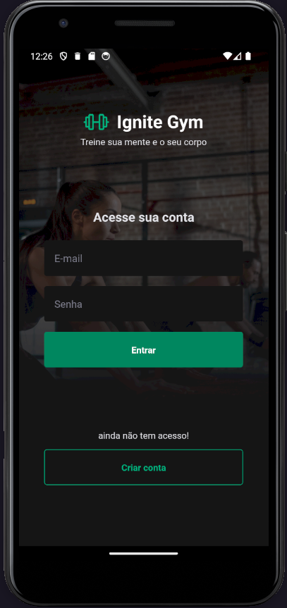
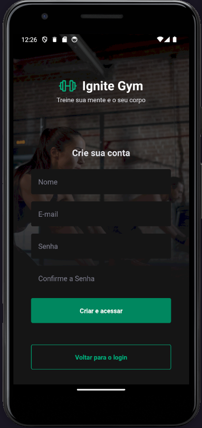
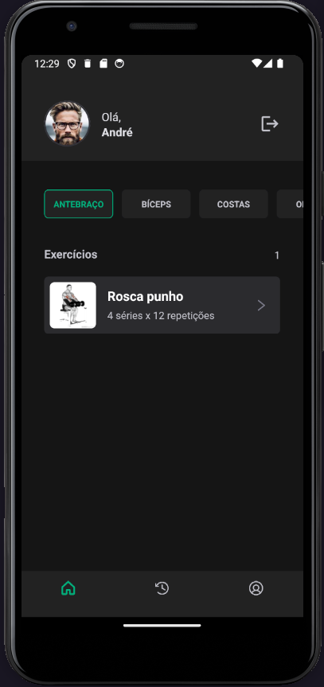
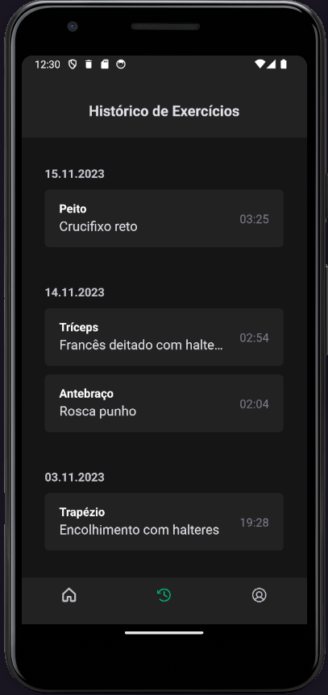
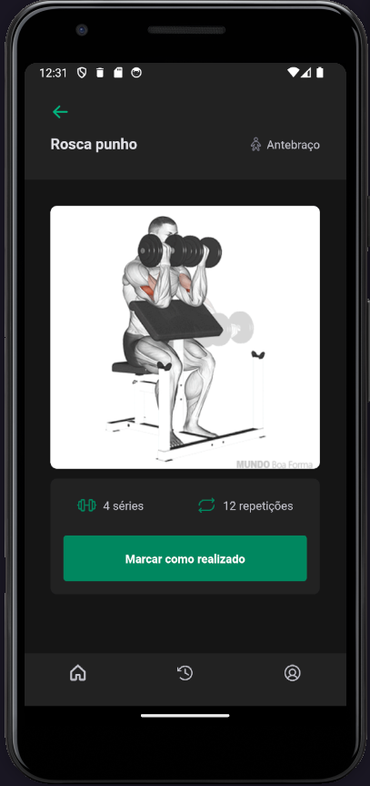
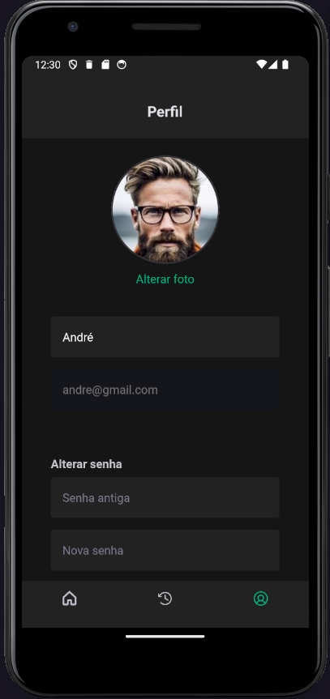

## TELAS DO APP
## Telas de login, cadastro de usuário e home.

### __________________________________________________________________________________________

## Telas de hostórico, exercícios e perfil.

### __________________________________________________________________________________________
# Guia de Instalação.

## [1º] Comando para criar o projeto
#### expo init ignitegym --yarn, deve escolher opção blanck typescript

## [2º] Instalação da lib babel
### yarn add --dev babel-plugin-module-resolver

## [3º] Instalação da fonte do google
### npx expo install expo-font @expo-google-fonts/roboto

## [4º] Instalação da biblioteca Native Base
### yarn add native-base
### expo install react-native-svg@12.1.1
### expo install react-native-safe-area-context@3.3.2

## [5º] Instalar react-native-svg-transformer para usar como componente
### yarn add --dev react-native-svg-transformer 

### 'Deve ser criado o arquivo metro.config.js, instrução na lib de instalação'.
### 'definir tipagem svg.d.ts,  instrução na lib de instalação'.

## [6º] Instalar o React navigation
### yarn add @react-navigation/native
### npx expo install react-native-screens react-native-safe-area-context
### yarn add @react-navigation/native-stack

## [7º] instalando  Use an image picker
#### npx expo install expo-image-picker

## [8º] Instalando fileSistem
### npx expo install expo-file-system

## [9º] Instalar o react hook forfm
### npm install react-hook-form

## [10º] Instalanção do axios cliente
### npm install axios

